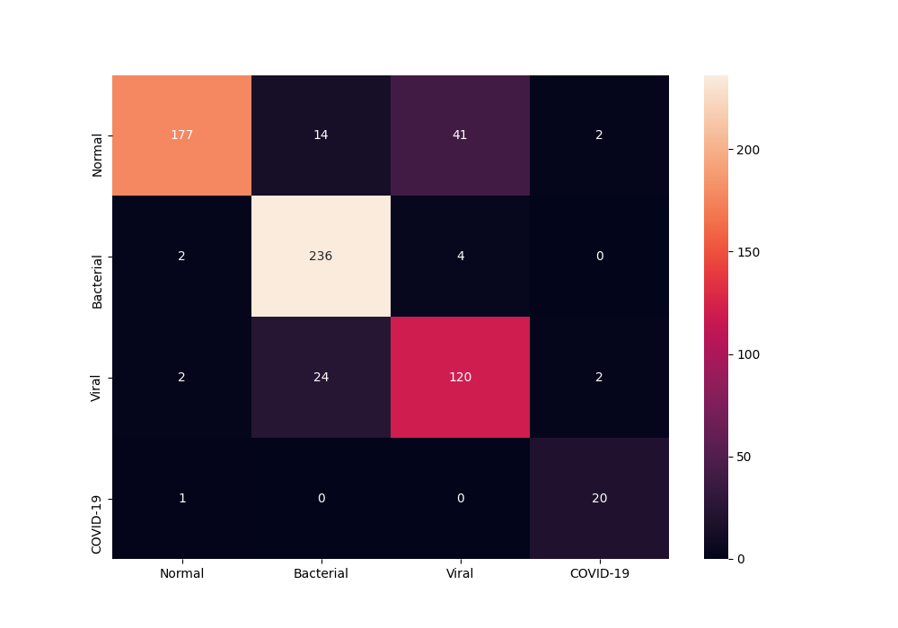
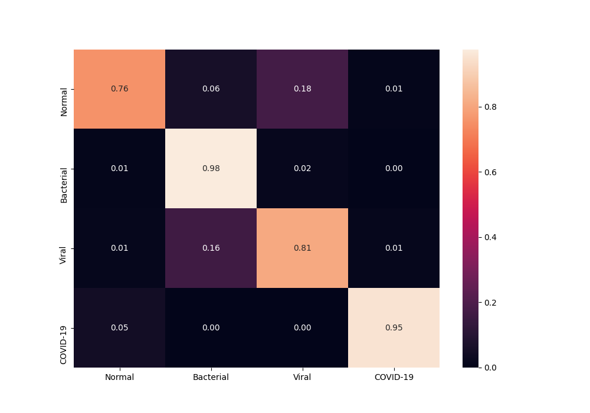

# CovidXNet for Identification of COVID-19 from X-Ray Images

 CheXNet for Classification and Localization of Thoracic Diseases

We present a PyTorch (python3) based implementation, to identify COVID-19 cases from X-Ray images. The model takes as input a chest X-Ray image and outputs the probability scores for 4 classes (`NORMAL`, `Bacterial Pneumonia`, `Viral Pneumonia` and `COVID-19`).

It is based on [CheXNet](https://stanfordmlgroup.github.io/projects/chexnet/) (and it's reimplementation by [arnoweng](https://github.com/arnoweng/CheXNet)).


## Setup and Installation

### Code

Clone the repo
```
git clone --recursive https://github.com/arpanmangal/CovidXNet.git
```

### Dataset
`CovidXNet` uses the [covid-chestxray-dataset](https://github.com/ieee8023/covid-chestxray-dataset) for COVID-19 X-Ray images and [kaggle-pneumonia-dataset](https://www.kaggle.com/paultimothymooney/chest-xray-pneumonia) for data on Pneumonia and Normal lung X-Ray images. 

Download and save the kaggle-pneumonia-dataset in the current folder.

### Data Distribution
Chest X-Ray image distribution
|  Type | Normal | Bacterial Pneumonia | Viral Pneumonia | COVID-19 | Total |
|:-----:|:------:|:---------:|:--------:|:--------:|:-----:|
| Train |  1337  |    2530 |  1338  |   97   | 5302 |
| Val   | 12 | 8 | 7 | 10 | 37
|  Test |   234 | 242 | 148  |  21   |   645 |

### Requirements
The main requirements are listed below

- Python 3.6+
- PyTorch 0.3
- Torchvision 0.1
- Numpy
- Pillow
- Scikit-learn
- Pandas
- Seaborn
- Matplotlib
- Tqdm

### Prepare the dataset
1. Prepare the COVID-19 dataset:
   
   We randomly select a subset of patients for `test` and `val` sets.
   ```
   python data_tools/prepare_covid_data.py
   ```
   Modify the file and rerun to update the train-val-test data split.

2. Prepare the combined dataset:

   ```
   python data_tools/prepare_data.py
   ```
   - Class 0: Normal
   - Class 1: Bacterial Pneumonia
   - Class 2: Viral Pneumonia
   - Class 3: COVID-19

### Prepare the pretrained-model
`CovidXNet` uses the pretrained `CheXNet` model from [here](https://github.com/arnoweng/CheXNet/). We modify the network to classify among 4 classes, while keeping the convolutional layers same. Thus we initialize with `CheXNet` pretrained model weights and fine-tune on top of it.

```
python tools/transfer.py
```

## Training and Evaluation
### Train the classifier layer
First we train the classifier layer, while freezing the weights of the convolutional layers to be the same as `CheXNet`.
```
python tools/trainer.py --mode train --freeze --checkpoint models/CovidXNet_transfered.pth.tar --save <PATH_TO_SAVE_MODELS_FOLDER>
```

### Fine tune the convolutional layers
Next we take the best model from previous step (according to loss), and fine tune the full model. Since we are interested in increasing the recall of `COVID-19`, we specify the `inc_recall` option to `3` (see our paper (coming soon) for details).
```
python tools/trainer.py --mode train --checkpoint <PATH_TO_BEST_MOMDEL> --save <PATH_TO_SAVE_MODELS_FOLDER> --inc_recall 3
```

### Test the model
Next we run the best model on the test set to see the results.
```
python tools/trainer.py --mode test --checkpoint <PATH_TO_BEST_MODEL> --cm_path plots/cm_best
```

## Results

We present the results in terms of both the per-class AUROC (Area under ROC curve) on the lines of `CheXNet`, as well as confusion matrix formed by treating the most confident class prediction as the final prediction. We obtain a mean AUROC of `0.9584`.

<center>

| Pathology  |   AUROC    |
| :--------: | :--------: |
| Normal Lung  | 0.9584 |
| Bacterial Pneumonia | 0.9705 |
| Viral Pneumonia | 0.8954 |
| COVID-19 | 0.9986 |


| Confusion Matrix             |  Normalized Confusion Matrix |
|:-------------------------:|:-------------------------:|
|  |  |

</center>


## TODO
- Add support for `torch>=1.0`
- Support for multi-GPU training