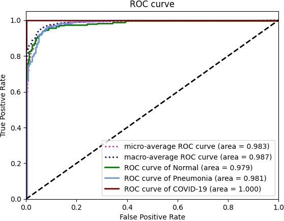
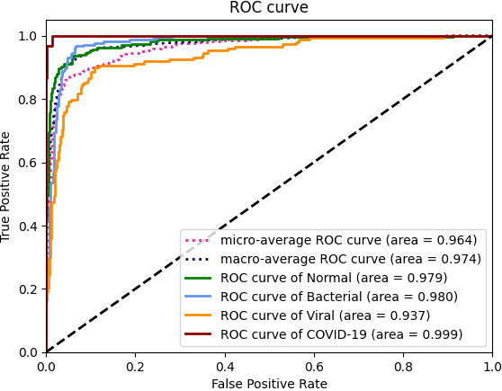
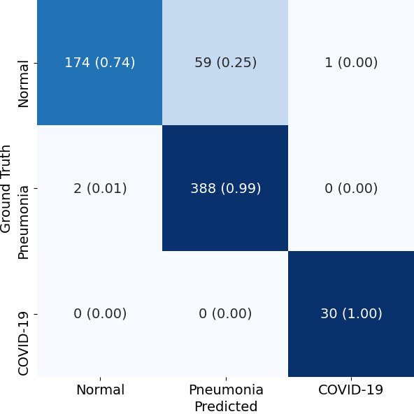
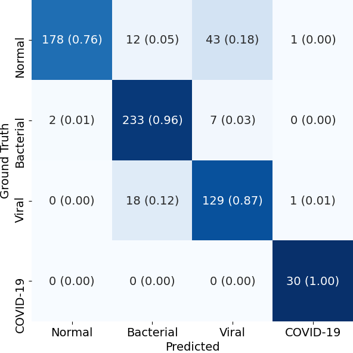
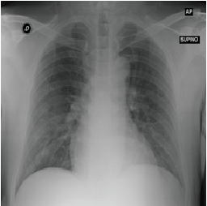
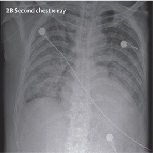
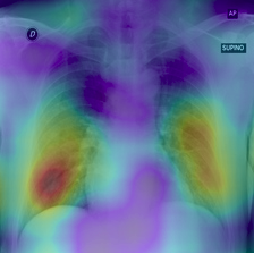
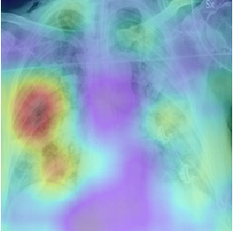
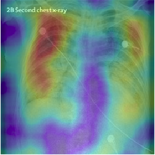

# From X-RAY Images Detection Of COVID-19 By CovidAID

We present `CovidAID` (Covid AI Detector), a PyTorch (python3) based implementation, to identify COVID-19 cases from X-Ray images. The model takes as input a chest X-Ray image and outputs the probability scores for 4 classes (`NORMAL`, `Bacterial Pneumonia`, `Viral Pneumonia` and `COVID-19`).

It is based on [CheXNet](https://stanfordmlgroup.github.io/projects/chexnet/) (and it's reimplementation by [arnoweng](https://github.com/arnoweng/CheXNet)).


## Installation
Please refer to [INSTALL.md](./INSTALL.md) for installation.

## Dataset
`CovidAID` uses the [covid-chestxray-dataset](https://github.com/ieee8023/covid-chestxray-dataset) for COVID-19 X-Ray images and [chest-xray-pneumonia](https://www.kaggle.com/paultimothymooney/chest-xray-pneumonia) dataset for data on Pneumonia and Normal lung X-Ray images. 

### Data Distribution
Chest X-Ray image distribution
|  Type | Normal | Bacterial Pneumonia | Viral Pneumonia | COVID-19 | Total |
|:-----:|:------:|:---------:|:--------:|:--------:|:-----:|
| Train |  1341  |    2530 |  1337  |   115   | 5323 |
| Val   | 8 | 8 | 8 | 10 | 34
|  Test |   234 | 242 | 148  |  30   |   654 |

Chest X-Ray patient distribution
|  Type | Normal | Bacterial Pneumonia | Viral Pneumonia | COVID-19 | Total |
|:-----:|:------:|:---------:|:--------:|:--------:|:-----:|
| Train |  1000  |   1353 | 1083   |   80   | 3516 |
| Val   | 8 | 7 | 7 | 7 | 29
|  Test |   202 | 77 | 126  |  19   |   424 |


## Get started
Please refer our paper [paper](http://arxiv.org/abs/2004.09803) for description of architecture and method. Refer to [GETTING_STARTED.md](./GETTING_STARTED.md) for detailed examples and abstract usage for training the models and running inference.

## Results

We present the results in terms of both the per-class AUROC (Area under ROC curve) on the lines of `CheXNet`, as well as confusion matrix formed by treating the most confident class prediction as the final prediction. We obtain a mean AUROC of `0.9738` (4-class configuration).

<center>
<table>
<tr><th></th><th>3-Class Classification</th><th>4-Class Classification</th></tr>
<tr>
<td></td>
<td>

| Pathology  |   AUROC    | Sensitivity | PPV
| :--------: | :--------: | :--------: | :--------: |
| Normal Lung  | 0.9795 | 0.744 | 0.989
| Bacterial Pneumonia | 0.9814 | 0.995 | 0.868
| COVID-19 | 0.9997 | 1.000 | 0.968

</td><td>

| Pathology  |   AUROC    | Sensitivity | PPV
| :--------: | :--------: | :--------: | :--------: |
| Normal Lung  | 0.9788 | 0.761 | 0.989
| Bacterial Pneumonia | 0.9798 | 0.961 | 0.881
| Viral Pneumonia | 0.9370 | 0.872 | 0.721
| COVID-19 | 0.9994 | 1.000 | 0.938

</td></tr> 
<tr>
<td>ROC curve</td>
<td>



</td><td>



</td>
</tr>
<tr>
<td>Confusion Matrix</td>
<td>



</td><td>



</td>
</tr>


</table>
</center>

## Visualizations
To  demonstrate  the  results  qualitatively,  we  generate  saliency  maps  for  our model’s  predictions  using  RISE. The purpose of these visualizations was to have an additional check to rule out  model  over-fitting  as  well  as  to  validate  whether  the  regions  of  attention correspond to the right features from a radiologist’s perspective. Below are some of the saliency maps on COVID-19 positive X-rays.

<center>

<table>
<tr>
<td>

 

</td><td> 

 

</td><td> 



</td></tr>

<tr><td> 

 

</td><td> 

 

</td><td>



</td></tr>
</table>


</center>

## Contributions

This work was collaboratively conducted by Arpan Mangal, Surya Kalia, Harish Rajgopal, Krithika Rangarajan, Vinay Namboodiri, Subhashis Banerjee and Chetan Arora.

### Citation
```
@article{covidaid,
    title={CovidAID: COVID-19 Detection Using ChestX-Ray},
    author={Arpan Mangal and Surya Kalia and Harish Rajgopal and Krithika Rangarajan and Vinay Namboodiri and Subhashis Banerjee and Chetan Arora},
    year={2020},
    journal={arXiv 2004.09803},
    url={https://github.com/arpanmangal/CovidAID}
}
```

## Contact
If you have any question, please file an issue or contact the author:
```
Arpan Mangal: mangalarpan@gmail.com
Surya Kalia: suryackalia@gmail.com
```

## TODO
- Add support for `torch>=1.0`
- Support for multi-GPU training
